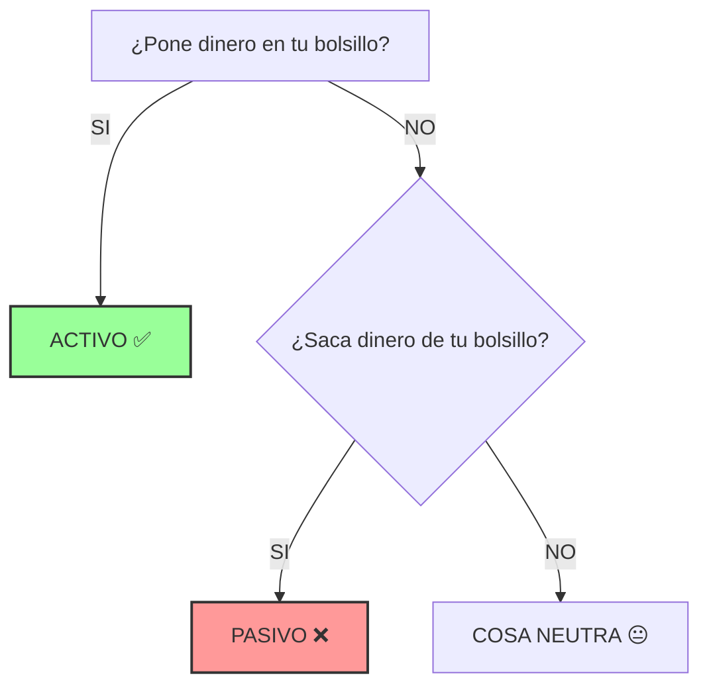
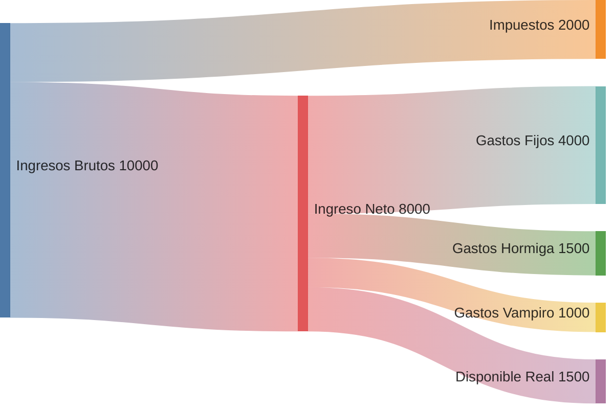
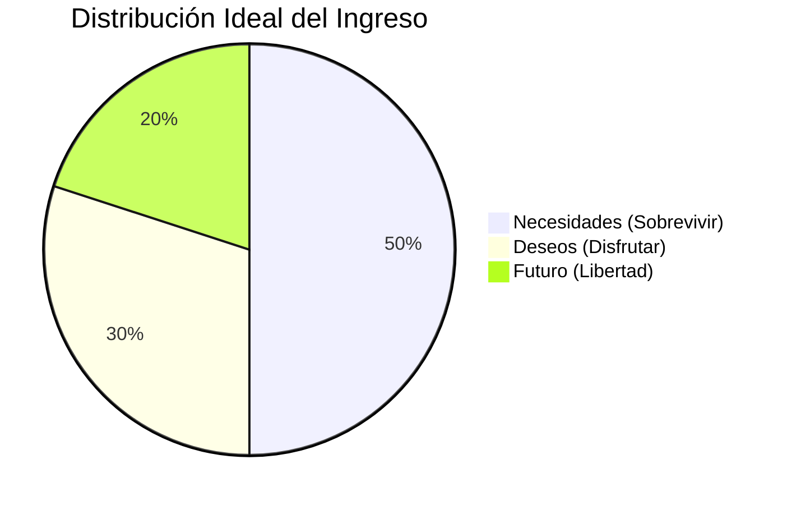
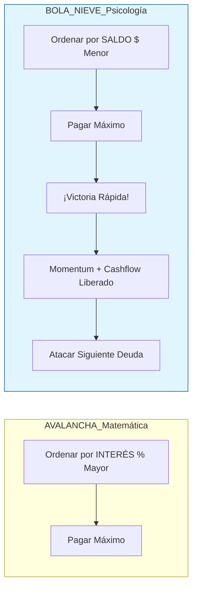
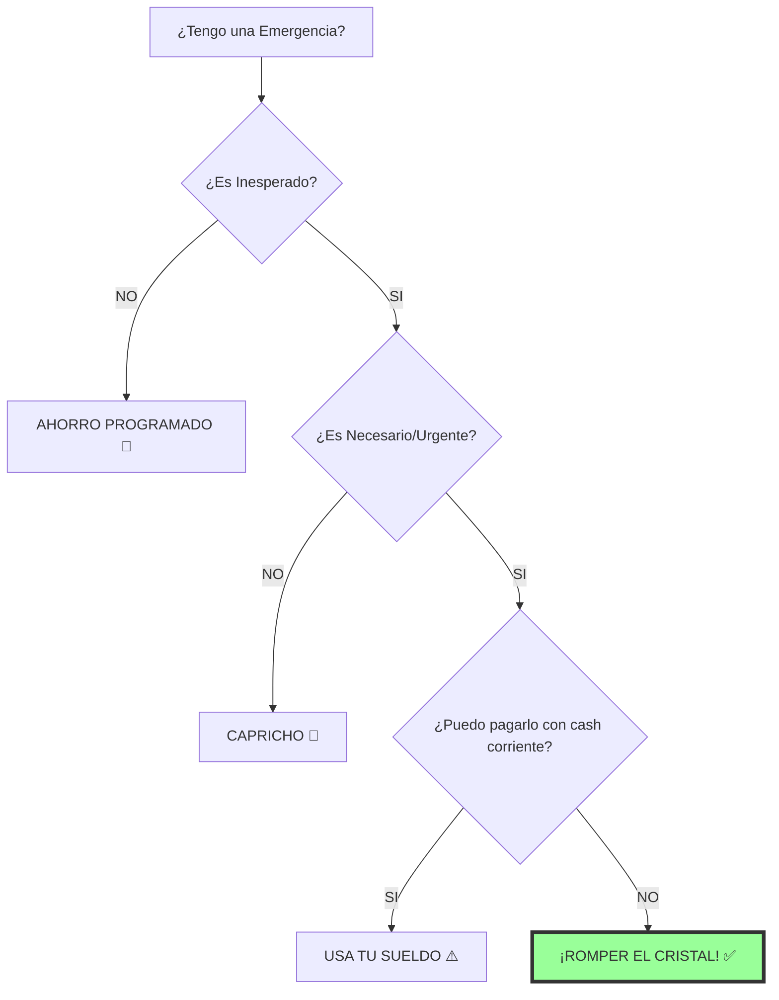

# DIAGRAMAS CLAVE: FINANZAS EN EL HOGAR

## 1. EL FILTRO DE PATRIMONIO (Módulo 1)

¿Es un Activo o un Pasivo?

## 2. EL FLUJO DE CAJA REAL (Módulo 1)

Dónde se pierde el dinero.

## 3. LA REGLA 50/30/20 (Módulo 2)

El Sistema Operativo Financiero.

## 4. BOLA DE NIEVE vs AVALANCHA (Módulo 3)

## 5. SEMÁFORO DE FONDO DE EMERGENCIA (Módulo 4)

¿Lo uso o no?

